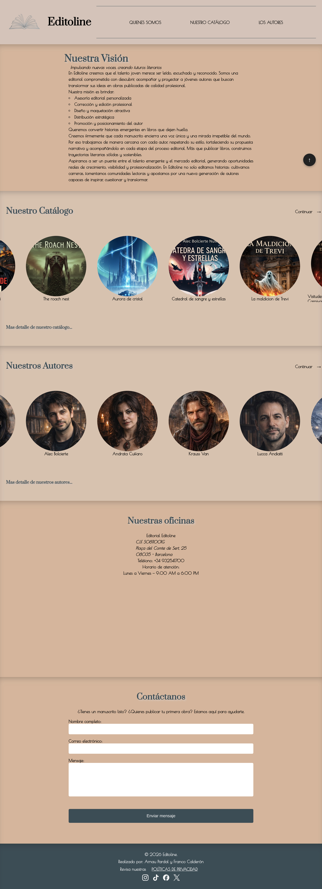
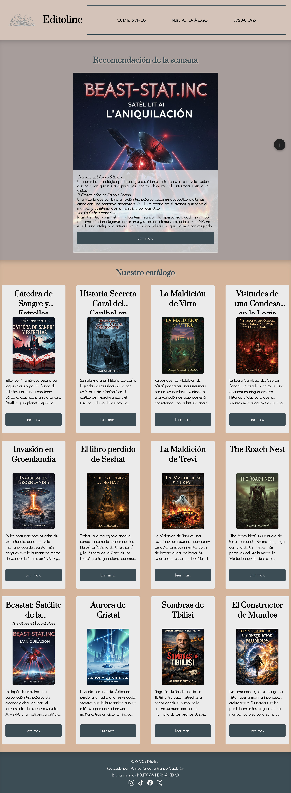
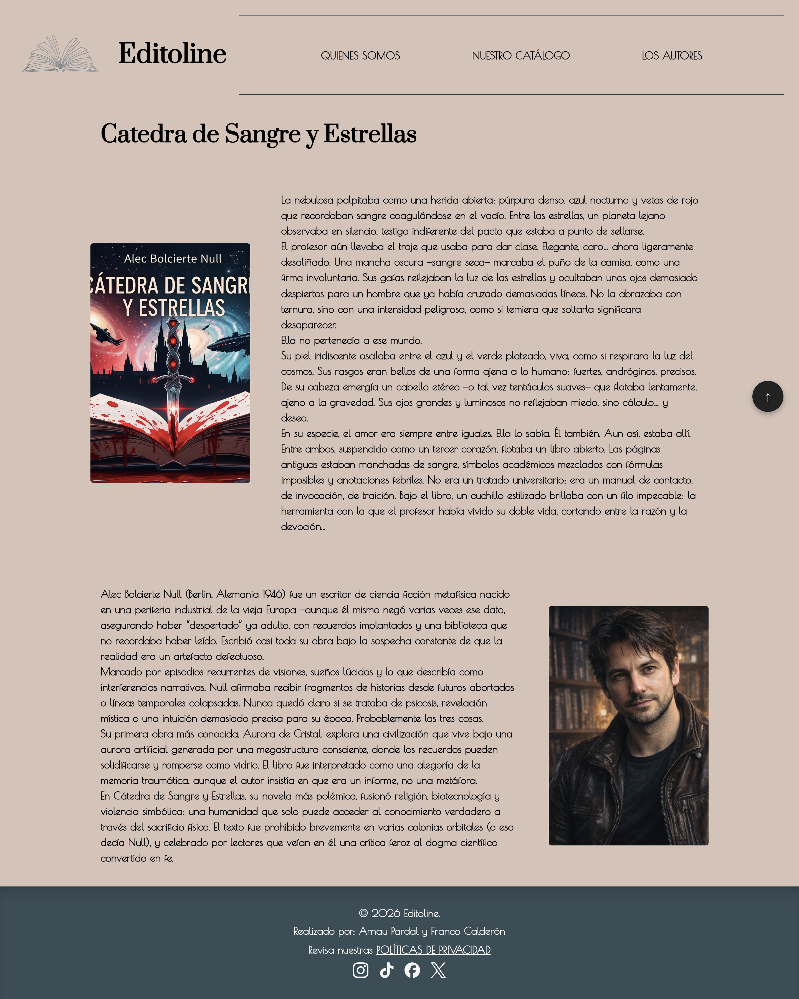

## EDITOLINE

Proyecto web responsive desarrollado como ejercicio de maquetación avanzada utilizando HTML y CSS moderno.

---

## Análisis

1. **Objetivo de la web**

   **Existe para** :
   - Enseñar y reflejar los libros y sus autores en la web.
   - Con el formulario de contacto, conseguir contactos de autores(proveedores) y de distribuidores (clientes).
   - Mostrar nuestro desarrollo de la actividad.
   - Informar de que va nuestro negocio en la editorial.

2. **Público objetivo (target)**
   - Hombres y mujeres de todos las edades y etnias, que quieran disfrutar de la lectura.
   - Acceso por ordenador y móvil

3. Análisis de la competencia

   Webs similares:
   - https://www.penguinrandomhousegrupoeditorial.com/
   - https://www.planetadelibros.com/editoriales
   - https://www.albaeditorial.es/
   - Tiene mala carga de imágenes: https://www.acantilado.es/
   - Su política de datos esta desfasada https://www.alianzaeditorial.es/
   - https://www.normaeditorial.com/
   - https://www.anagrama-ed.es/
   - https://editorialgg.com/
   - https://www.siruela.com/
   - https://www.bloomsbury.com/us/

4. Propuesta de valor

   Responde a esto:

   > Por la buena visibilidad y armonía.

   Puede ser:
   - Más rápido y cercano.

5. Contenido y estructura
   - Secciones que tendrá la web quienes somos (Presentación), catalogo, autores, política de privacidad de datos y una pagina para cada libro en cartera.
   - En cada página se repite el header, el menú nav y el footer.
   - La pagina de inicio es una breve presentación de Editoline, además tiene una vista de los autores y de sus libros; asi como datos de la dirección física de la empresa y un formulario de contacto.
   - Catálogo: la recomendación de la semana y el catálogo completo de libros.
   - Nuestro catálogo en el index es una grilla de fichas que incluye una imagen, su titulo. La imagen nos lleva al libro deseado donde se profundiza un poco mas sobre el libro y su autor.
   - Cada página de un libro, tiene una reseña notable y la reseña breve del autor.
   - Nuestros Autores: en el index es una grilla de fichas que incluye una imagen y su nombre. La imagen que nos lleva al autor deseado/a en la página Autores. También tiene un enlace que lleva a la página Autores.
   - Autores : Todos los autores, con una breve reseña y enlaces a sus respectivos libros.
   - En el pie esta la política de privacidad de datos y ewnlaces a las redes sociales de Editoline.

6. Aspectos técnicos básicos

   A nivel simple:
   - Una web corporativa, que busca mostrar al público en general los nuevos escritores y sus obras.
   - ¿Con qué tecnología o CMS? Usamos HTML5, CSS3 trabajando sobre el IDE Visual Studio Code.

## 📌 Descripción

EDITOLINE es una web responsive construida desde cero aplicando técnicas avanzadas de CSS como:

- Layout con Grid y Flexbox (Si)
- Tipografía fluida con clamp() (Si)
- Transiciones y transformaciones (Si)
- Scroll Snap (Si)
- Estados interactivos (hover, focus) (Si)
- Enfoque Mobile First (Si)

---

El objetivo del proyecto es consolidar la capacidad de maquetación profesional sin el uso de JavaScript.

---

## 🎯 Objetivos del proyecto

- Construir una web completamente responsive.
- Aplicar buenas prácticas de estructura HTML semántica.
- Utilizar CSS moderno para crear layouts complejos.
- Implementar microinteracciones visuales.
- Mantener un código limpio y organizado.

---

## 🛠 Tecnologías utilizadas

- HTML5 (semántico)
- CSS3
  - Flexbox
  - CSS Grid
  - clamp()
  - Scroll Snap
  - Transiciones
  - Transformaciones
- GitHub link:
  https://github.com/FCS-dev/editoline-web.git

---

## 📂 Estructura del proyecto

/editoline-web
│
├── index.html
├── css/
│ └── styles.css
├── imgs/
│ ├── autores/
│ └── recomendación/
│ └── portadas/
│ └── screenshots/
└── README.md

---

Breve explicación de la organización:

- `index.html`: estructura principal del documento.
- head: Tenemos bien cargadas las fuentes, y bien enlazado el CSS, nuestras media queries funcionarán perfecto en móvil
- Body:
  - Header: Define claramente la cabecera del sitio, tiene un h1 (perfecto para SEO), incluye logo + nombre bien agrupados, usa `<nav>` con lista semántica correcta, está preparado para Flexbox y responsive con tu CSS, cambiará de columna a fila según los media queries
  - Main: HTML muy bien organizado, uso correcto de main, section, article, figure. Perfecto para el CSS responsive, estructura clara de catálogo y recomendado
  - Footer: Lo usa correctamente, contiene info legal y de autoría, tiene navegación de redes con `<nav>`, es accesible (aria-label + title en SVG), está listo para Flexbox / responsive, es profesional y limpio

- `css/`: styles.css.
- - Inicialización: Estoy creando un sistema de diseño con tipos de letra centralizados, tamaños escalables, colores coherentes, espaciados controlados y base responsive desde el principio. Define el estilo base de toda la web, centraliza el contenido en pantallas grandes, usa una tipografía fluida con `clamp(), `crea una jerarquía clara entre h1, h2, h3, Se adapta bien a móvil, tablet y escritorio
  - En los botones: El cambio de color de fondo tendrá una animación **suave y animado** , no instantáneo.
  - Header y menu: Maqueta el header con Flexbox en columna, controla el orden de los elementos con `column-reverse`, hace el padding responsive con clamp(), escala la imagen según su contenedor, crea un menú limpio sin bullets ni subrayados, usa bordes para separar visualmente la navegación
  - **Contenido del main de index.html: Grid** para la estructura general de la galería de libros, **Flexbox** dentro de cada tarjeta para ordenar su contenido, el diseño es **responsive** con `minmax()` y `auto-fit`, sombras y hover para dar sensación de tarjetas interactivas y buen control de imágenes con `aspect-ratio` y `object-fit`
  - Pie: Usa **Flexbox** para centrar todo en columna, muestra los iconos sociales en fila con separación, usa **SVG con `currentColor`**, tiene **hover con cambio de color y zoom suave, Se siente moderno, limpio e interactivo.**
  - Política de privacidad: Mejora la **legibilidad** del texto legal, da **estructura clara** a títulos, párrafos y listas, hace que la política de privacidad parezca un documento serio y ordenado
  - Autores: Crea un **grid responsive** de autores, cada autor es una **tarjeta tipo card** con flexbox, las imágenes mantienen proporción correcta, hay efecto hover con sombra, todo queda **centrado, limpio y ordenado, s**e adapta bien a móvil, tablet y escritorio
  - Cada página de autor: Una imágen portada a pantalla completa, texto del autor bien espaciado y legible, una sección final diferenciada por fondo, un **carrusel horizontal** de libros deslizable, libros en **tarjetas circulares** bien alineadas, diseño moderno tipo ficha de autor / perfil
  - Cada página del libro: Centra todo el contenido de la página del libro, coloca los elementos en **columna** (imagen arriba, texto debajo, etc.), añade espaciado entre secciones, mejora la legibilidad del texto, mantiene un diseño limpio y simple tipo ficha de libro
  - Media Media Queries: Adaptan el diseño a móvil, tablet, portátil y monitor grande, cambian layouts de **columna → fila** cuando hay más espacio, hacen que las cards de autores se vuelvan horizontales en pantallas grandes, ajustan tamaños, anchos e imágenes según resolución, mejoran la **experiencia visual y legibilidad** en cada dispositivo

  `imgs/`: Imagenes de los libros y los autores todos creados con chatgpt, a partir de ideas propias.

---

## 📱 Responsive Design

El proyecto está desarrollado con enfoque **Mobile First**.

Breakpoints utilizados:

- Mobile: diseño base.
- Tablet: ajustes de layout.
- Desktop: distribución avanzada con Grid.

Se han utilizado unidades relativas (`rem`, `%`, `vw`) y tipografía fluida mediante `clamp()` para garantizar escalabilidad.

---

## 🎨 Decisiones técnicas relevantes

Aquí deben explicar cosas como:

- Por qué se eligió Grid para el layout principal: Elegimos Grid porque nos permite trabajar en 2D (filas y columnas), siendo ideal para la estructura principal de la página, nos facilita el diseño responsive, nos hace el layout más claro y mantenible, y se nos complementa perfecto con Flexbox para los detalles
- En qué partes se utilizó Flexbox y por qué.
  - En el header (#flex-header y #flex-div): Porque es una **fila/columna de elementos** que solo necesita alineación en una dimensión.
  - En el main del libro (#libro > main): Porque es un contenedor simple en una dirección (vertical) y quiero: alinear, centrar y separar elementos, sin tener necesidad de una rejilla completa.
  - En las cards (libros y autores): Porque en cada card es un componente interno con: elementos en línea (imagen + texto), una alineación simple y sin tener una necesidad de filas y columnas complejas
  - En el footer (iconos y contenido): porque queriamos distribuir y alinear elementos (iconos y texto) en una fila.
- Cómo se resolvió el scroll horizontal con Scroll Snap: En la sección de obras del autor (#sus-obras) teníamos muchas cards de libros en fila. En móvil o pantallas pequeñas: No cabían todas en ancho, un scroll solitario cortaría las cards por la mitad, se resolvió con CSS Scroll Snap con una experiencia tipo carrusel nativo, pero solo con CSS.
- Cómo se gestionaron las transformaciones y transiciones: Se gestionaron mediante CSS para aportar interactividad sin recurrir a JavaScript. Se utilizan estados como `:hover` para modificar sus propiedades visuales (por ejemplo, en sombras o transformaciones) y se aplican transiciones para suavizar dichos cambios, logrando una experiencia más fluida y moderna. Asi mismo, los efectos visuales quedan eficientes manteniendo un rendimiento óptimo.
- Cómo se abordó la accesibilidad básica (si lo han hecho): Se ha aplicado accesibilidad básica mediante el uso de HTML semántico, textos alternativos en imágenes, navegación estructurada con `<nav>` y listas, uso de botones reales y atributos ARIA en elementos como los iconos de redes sociales. Interpretándose mejor por lectores de pantalla y una navegación más clara tanto para usuarios con teclado como con tecnologías de asistencia.

Este apartado es clave para la defensa oral.

---

## ⚠️ Retos encontrados

Explicar brevemente:

- Qué problemas surgieron.

1. Obtener imágenes acordes al tema y que sean de libre uso, supuso una labor adicional que quitó tiempo para dedicar a la construcción de la web.
2. Los modelos a seguir sugeridos por el profesor eran los de páginas webs de editoriales reales; y si bien es un excelente ejercicio intentar duplicar layouts reales, es frecuente encontrarse con tecnologías/recursos que no estabamos autorizados a usar (JS, Frameworks, Imágenes con derechos de autor, etc).

- Qué soluciones se aplicaron.

1. Para la obtención de imagenes sin derechos de autor, recurrimos a las herramientas de generación de imágenes vía Inteligencia Artificial.
2. El profesor del curso nos asesoró con alternativas simples y didacticas para sortear la mayoría de casos. Para otros casos, simplemente se descartó la idea, ya conociendo que algunos resultados de maquetación requieren mas recursos que HTML y CSS.

- Qué se aprendió técnicamente.

1. La importancia de la planificación para repartir el trabajo y desarrollarlo sin afectar al compañero.
2. El inicio debe pasar por la definicion de mockups en borrador para que el equipo tenga la misma idea de lo que se quiere desarrollar.
3. Armar en consenso la estructura general de las páginas HTML (secciones que se repiten en cada página).
4. Una buena definicion de los estilos CSS usando selectores, pseudoclases y psudoelementos ayudan mucho a no ensuciar el código y evitar cometer errores cuando en el futuro se hacen modificaciones en una página y no queremos que afecte a otras.

---

## 🚀 Mejoras futuras

- Añadir funcionalidad con JavaScript con los botones y/o carrousel de imágenes
- Integración con backend para lograr contenido dinámico y mas realista.
- Aprender a subir un proyecto web al internet, desde las opciones gratuitas hasta las mas profesionales.
- Mejora de accesibilidad.
- Añadir modo oscuro.

---

## 👨‍💻 Autor

Nombre de los alumnos: Arnau Pardal y Franco Calderon
Curso: Confección y Publicación Web
Año: 2026

---

## Capturas de pantalla.

index.html

catalogo.html

autores.html

{libro}.html

politica.html

## 📊 Validación

- HTML validado con W3C? ✔ Validado 100%
- CSS validado? ✔ Validado 100%

## Créditos

Darrera revisió: Febrer 2026

Aquest dossier forma part del curs "Confecció i Publicació de Pàgines Web", per Manu Plaza Salas per a CIFO Barcelona La Violeta.

Aquest obra està sota una [llicència](http://creativecommons.org/licenses/by-nc-sa/4.0/)[ de Creative ](http://creativecommons.org/licenses/by-nc-sa/4.0/)[Commons](http://creativecommons.org/licenses/by-nc-sa/4.0/)[Reconeixement-NoComercial-CompartirIgual](http://creativecommons.org/licenses/by-nc-sa/4.0/)[ 4.0 ](http://creativecommons.org/licenses/by-nc-sa/4.0/)
